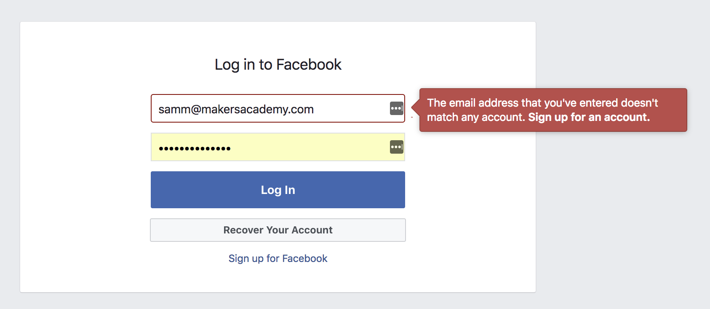

# Walkthrough – Validations

[Back to Challenge](../12_validations.md)

**Validations** used to force users to submit the right data into your database, and to show them an error if they didn't:



This walkthrough is in three parts:

- Adding a feature test for an invalid URL.
- Adding Sinatra-Flash to show a message, passing this test.
- Refactoring the validation logic into the `Link` model.

> If you prefer to work from a code diff, there is a commit for this challenge [here](https://github.com/sjmog/bookmark_manager/commit/41024c5617f84880400881a81d83fd7a6a3a42ee).

## 1. Adding a feature test for an invalid URL

Here's the user flow for submitting an invalid URL:

1. Visit the new link page.
2. Submit a new link with a string like 'not a link'.
3. See an error message, and don't see 'not a link' in the list of links.

Here's that flow in Capybara terms:

```ruby
# in spec/features/adding_a_new_link_spec.rb

scenario 'The link must be a valid URL' do
  visit('/add-a-new-link')
  fill_in('url', with: 'not a real link')
  click_button('Submit')

  expect(page).not_to have_content "not a real link"
  expect(page).to have_content "You must submit a valid URL."
end
```

When we run this test, it fails as expected.

## 2. Passing the test, and adding Sinatra-Flash

We can solve this test in the controller, using [Ruby's built-in `uri` module](https://stackoverflow.com/questions/1805761/how-to-check-if-a-url-is-valid):

```ruby
# in app.rb
require 'uri'

post '/create-new-link' do
  if params['url'] =~ /\A#{URI::regexp(['http', 'https'])}\z/
    Link.create(url: params['url'])
  else
    flash[:notice] = "You must submit a valid URL."
  end

  redirect('/')
end
```

> The Flash is used to display one-time messages.

To use the `flash`, we need to add the `sinatra-flash` gem to our Gemfile, install it to our project, and include `sinatra/flash` in our controller. Then, we need to `enable :sessions`.

Instructions for doing all that are on the [Sinatra-Flash gem Github page](https://github.com/SFEley/sinatra-flash).

## 3. Refactoring the validation logic into the `Link` model

Our `/create-new-link` route is looking very messy. Wouldn't it be great if `Link.create` just handled validating URLs on its own?

Let's write a unit test for that:

```ruby
# in spec/link_spec.rb

describe '.create' do
  it 'does not create a new link if the URL is not valid' do
    Link.create(url: 'not a real link')

    expect(Link.all).not_to include 'not a real link'
  end

  ### other test omitted for brevity ###
end
```

We can pass the test by simply moving the validation into the `Link.create` method. Let's split it out to a private method, too:

```ruby
# in link.rb

class Link
  def self.create(options)
    return false unless is_url?(options[:url])
    DatabaseConnection.query("INSERT INTO links (url) VALUES('#{options[:url]}')")
  end

  private

  def self.is_url?(url)
    url =~ /\A#{URI::regexp(['http', 'https'])}\z/
  end

  ### rest of the class omitted for brevity ###
end
```

Now we can use this updated `create` method in our controller:

```ruby
# in app.rb

post '/create-new-link' do
  flash[:notice] = "You must submit a valid URL." unless Link.create(url: params['url'])
  redirect('/')
end
```

Our test still passes: and now we've unit-tested it, too. Great!

[Next Challenge](../13_the_orm_pattern.md)
