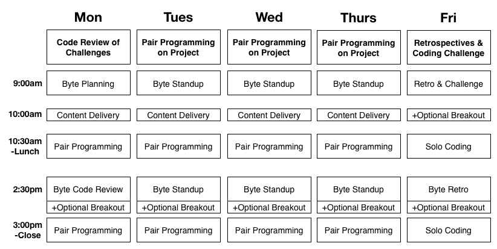
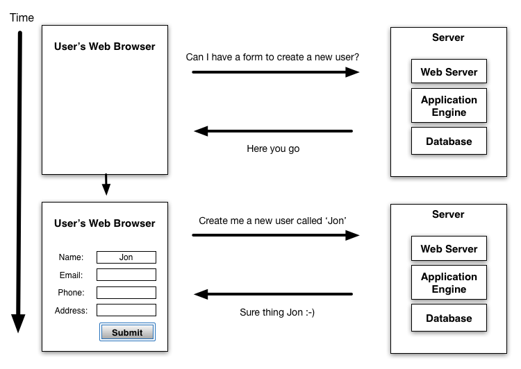
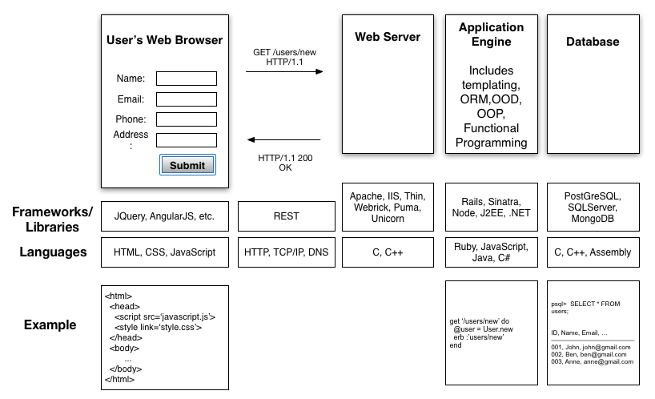

Introduction
===========

The Makers Academy experience is designed to emulate important aspects of working as a software developer and applying for software developer jobs.  Software developers don't spend hours sitting in lectures, either in their jobs or during job search. At work they have quick standup meetings each morning and then learn on the job, researching new things collaboratively with their peers.  Hunting for jobs they do technical tests, attend interviews and work on open source projects. To reflect this the Makers Academy week is divided into three essential components:

1. Coding Challenges
2. Code Review
3. Pair Programming Projects

The coding challenges are a simulation of the kinds of technical tests you will need to pass to get a job with a software company.  The code reviews and pair programming projects are a replica of the activities you will need to excel at as part of your job in a software company.

As part of the Makers experience you will be placed in a 'Byte' which consists of between 6-12 students.  Think of this as your software engineering team.  You will be assigned a coach who will serve to help you organize and run 'Byte' meetings.  You will have a twice daily short 'standup' meeting with your Byte in order to identify common problems and solutions.  Standups traditionally have people stand up rather than sit in order to ensure that the meeting is short. More details below, but first let's look at an overview of a standard Makers week.

Overview of the Makers Week
-------------------------

Coding challenges are released every Friday and your attempted solution must be submitted via pull request by Monday at 9am.  It does not matter if you complete the challenge or not.  Submit the challenge with however much or how little code you have working.  Also note that you can submit the pull request as early and as frequently as you like; you will receive some automated feedback on your solution.  Mondays are code review days and you will receive both peer and coach feedback on your code.

Tuesdays, Wednesday and Thursdays are pair programming project days.  You will work in a pair with another student on a coding project. Ideally you will swap pair partners each day.  The following diagram summarizes the flow of the week:

Organizational meetings are designed to reflect those used in real software companies with a team meeting early every morning.  Real software companies often work in iterations of 2 to 4 weeks, however we have compressed that structure at Makers to accelerate your progress.  In a single week you will have between 6-10 short (<15 min) standup meetings to coordinate with other students in your Byte (morning and afternoon).  Meetings on Monday can run a little longer as part of code review and planning for the week.  Meetings on Fridays can also run a little longer for reflecting on the week (retrospectives).  The pattern of Plan, Execute (with coordination standups) and Reflect is the heart of Agile Software Development.  More details on that below, but first here is the more detailed structure of the week:

Note that each byte standup should consist of going round every member of the byte, and having them answer to the group three questions of the form 'what did you do yesterday?', 'what, if anything, is blocking you?', and 'what is your plan for the day?'.  The idea with a standup is to go into as little detail as possible, for example.  "Yesterday I worked with my pair on test-driving the creation of a Van class, and we got stuck on RSpec shared examples.  Today we are going to continue on that and hopefully resolve the issue".  The idea is for everyone to be in the loop about where each other is and what they are stuck on.  Any longer discussion should be moved to another meeting - potentially immediately after the standup.  It's the responsibility of everyone in the standup to ensure that long discussions do not break out, and that if longer discussions are needed that these are scheduled for later.

Once the quick standup is out the way there is time for a content deliver session in the morning.  This will usually be with the whole cohort to set the agenda for the day.  In the afternoon there are optional breakout sessions. Starting these assumes that everyone in the standup has been able to answer their three questions, and now everyone is in the loop about where everyone is and what is blocking them.  The breakout session can then be less formal, sitting down, involving some or all of the students in the byte, using a whiteboard, or using a projector.  Ideally the breakout session should not take too long, and some students may want to go straight off to pairing, but ultimately it is up to the coach and students to coordinate what they do in a breakout session, if one happens at all.

Overview of the Course Week
-------------------------

The weekly structure is maintained consistently for the first five weeks, but then gradually the structure is removed:

**Junior Portion**

1             |  2          | 3               | 4                | 5          | 6        |
--------------|-------------|-----------------|------------------|------------|----------|
Boris Bikes   | Battleships | Battleships Web | Bookmark Manager | JavaScript | Lab Week |

**Senior Portion**

7                  |  8                | 9      | 10        | 11        | 12              |
-------------------|-------------------|--------|-----------|-----------|-----------------|
Further JavaScript | Makerthon (Teams) | Rails  | Project 1 | Project 2 |   Hiring Week   |

Each week there will be learning objectives relating to the particular project and pre-reading materials based on the learning objectives.

* Office Hours (9am-9pm)
* Coach Availability (9am-noon - 2:30pm-6pm)
  - supporting you becoming active learners
  - wean yourself off the coaches and alumni helpers
* Weekly schedule - subject to change, just like the world of technology
* Be proactive - if you don't have something that you need, get it

You:

* MUST install slack desktop client
* MUST create a StackOverflow account
* REALLY SHOULD post or upvote on SO at least once a week
* MUST use sequence of asking for help (pair partner, peer, senior, stack-overflow, alumni-helper, coach)
* MUST submit code challenges
* MUST do byte planning, standups and retrospectives
* MUST show up

Ultimately we want all of you to be able to manage the whole web development stack, completely independently of us.

The Agile Process
---------------

The Agile process is the heart of Makers Academy. Agile sits in contrast to the big 'design up-front' approach of "give us £8M to build a system and we'll see you in two years and it might end up working".

This agile process is fundamental - it's about making sure that the process you are using to get towards your goal is being tuned to ensure that you are moving effectively towards your goal.

There are many techniques that are associated with agile development such as programming in pairs, performing code reviews, scrum, kanban, test driven development (TDD) and behaviour driven development (BDD); however none of these "is" Agile.  All of them are techniques that might be selected in the Agile planning process.  Agile itself does not specify that one particular technique or another should be used.  Agile specifies that a team should pick from the available techniques, execute the plan , and then reflect on the extent to which the team moved towards their goals, ideally with a quantifiable measurement of their progress.  During the reflection phase different techniques can be dropped, started, modified, tweaking; whatever the team thinks will best help them move towards their goal.

This doesn't mean that changes should be made carelessly or quickly.  It is best to avoid making too many changes in the process at one time because otherwise it is difficult to determine which change lead to any benefits or deficits.  However either way, the critical component is that all members of the team are clear about what is being changed for what reason and everyone has agreed to give the changes a try.

Three Tier Web Architecture
----------------

To be a successful web developer, you need to grasp this critical technical concept: Three Tier Web Architecture.

It's all about a process of communication between a user's web browser and a server.  A server is just another computer, but it's often a computer with a dedicated internet connection and lots of resources.  It will usually consist of a web server (to serve web pages), an application engine (to allow dynamic generation of those pages), and a database (to reliably store data related to those pages):

If we drill down a little we can see the *lingua franca* of the world-wide web: the HTTP protocol. This is the communication mechanism that allows the web to exist across multiple computers.  We can also see that the application engine is where web developers have to handle a lot of the complexity.  That is not to say that databases and web servers can't become very complex.  In fact they are very complex, but often they are just used "out of the box", and it's the application engine that takes up the most of a developers time in terms of creating new software.  It's the technologies relating to the application engine that will take up a good proportion of the time at Makers.

Drilling down even further we can see the names of the many technologies, languages, frameworks and protocols that are used at different levels in the three tier application stack, as well as examples of what some of these look like.  This diagram will largely seem like gobbledigook at the beginning of the course.  By the end of the course it will seem much clearer.  There will still be grey areas, but you will start to feel comfortable with knowledge of the different moving parts that allow you to create, and problem-shoot, large web applications.

Note, though, that there is far more complexity here than we can cover in 12 weeks.  To master it, you will need to become a self-directed learner. In particular, you'll need to use your agile process to drill down further into areas where you can acquire more knowledge.

The Three Tier Architecture is the Rosetta Stone of web development.  We want you to be great programmers and great project managers, and great team members, but critically we are focused on helping you become web developers. Understanding this architecture is key.

Archive
-------

* [Video of April 2015 Intro Session](https://www.youtube.com/watch?v=TlSskjGryK4)
  - [Bonus "Learning to Learn" with Sam Morgan](https://www.youtube.com/watch?v=_NSQkqOk5x0)
* [Video of March 2015 Intro Session](https://www.youtube.com/watch?v=zRb1WLbV_Sk)
* [Video of December 2014 Intro Session](https://www.youtube.com/watch?v=eq4fbus_9TQ)
