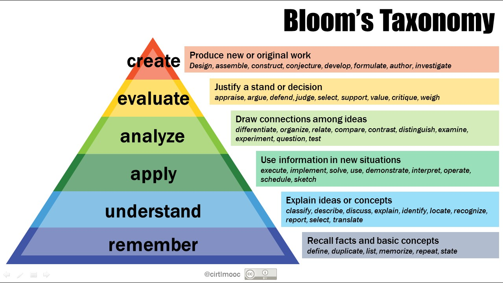

# Bloom's Taxonomy

Bloom's Taxonomy is the basis of much curriculum development. At the heart of the taxonomy is an attempt to answer this question:

> When we say we 'understand' something, what do we mean?

This question comes up a lot because educators tend to say things like:

- "You will understand TDD by the end of this session."
- "Do you understand Kant?"

Of course, they mean wildly different things. Bloom's taxonomy tries to give more detail about what they mean, as well as providing educators and learners with better terminology for discussing learning.

## Why is it useful?

A key part of learning is accurate self-assessment. Bloom's taxonomy gives you some language to evaluate and discuss your progress and others' progress. Also, it helps you to pick appropriate tasks to improve your ability in a particular topic. Finally, it helps you learn effectively when you're worknig with people who have more or less ability than you.

## The taxonomy

The taxonomy is a ‘cognitive process ladder’. You can use it to assess how good you are at any topic.

##### Level 1: describing

At the base level, there is ​_knowledge_​. Some useful words for this level: ‘describe, define’.

Let’s take the example of ‘TDD’.

The lowest level, ​_knowledge_​, would have a question like: ‘what does ‘TDD’ mean?’ and the answer is ‘TDD means *T*est *D*riven *D*evelopment.'

##### Level 2: understanding

Above that level sits ​_understanding_​. Words for this level: ‘explain, diagram'

Using TDD as an example:

- ​_Knowledge_​: “TDD means Test Driven Development”
- ​_Understanding_​: “Test Driven Development means ‘start with your tests first, write your code after’"

##### Level 3: doing

The next level is ​_application_​. Words for this level: ‘do, make, design’.

Using TDD as an example:

- ​_Knowledge_​: “TDD means Test Driven Development”
- ​_Understanding_​: “Test Driven Development means ‘start with your tests first, write your code after’”
- ​_Application_​: ​_build a basic program by starting with a test__

##### Bloom's taxonomy and the structure of the course

These first three levels: knowledge, understanding, application (or ‘describe, explain, do’) are the basis of the first six weeks of the course. Above these levels sit the next six weeks.

##### Better Pairing

Level 4 is ‘Analysis’. Words: ‘organise, break down'

With reference to TDD:

- ​_Analysis_​: I can identify where someone misunderstands TDD and correct that misunderstanding. For example, I can teach someone who believes that TDD means ‘tests after development’ that they have it the wrong way round.

Here’s where this gets exciting: pair programming involves mixing two people at different points on the taxonomy together with one another. But it’s boring for the ‘more advanced’ pair to stay static - just ​_doing_​, say - while the other pair learns to move from ​_knowledge_​ to ​_understanding_​. So, if you are the more advanced of a pair, your job is to ​_analyse_​. "Why is your pair misunderstanding? What’s the real problem here? It looks like a problem with TDD, but is it a lack of understanding in some other topic - like Ruby classes?"

## Resources

* [Samm's blog](sjmog.github.io)
* The original paper (Bloom 1956)
* Revised version of Bloom's paper (Krathwohl 2001).

-

(Edited version of an original document written by Samm.)
