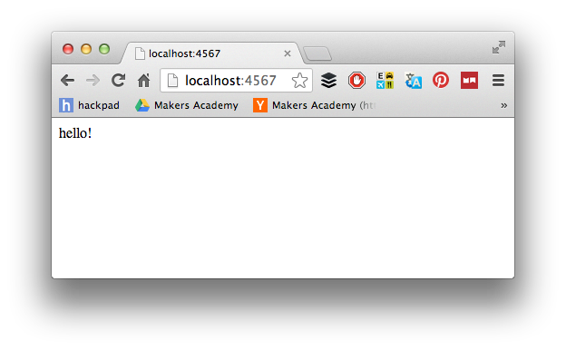
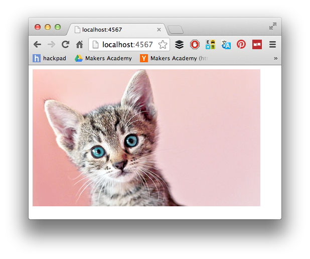
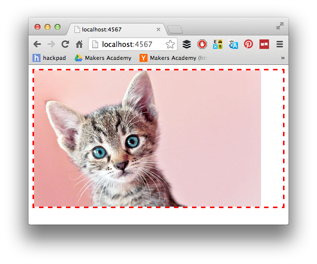
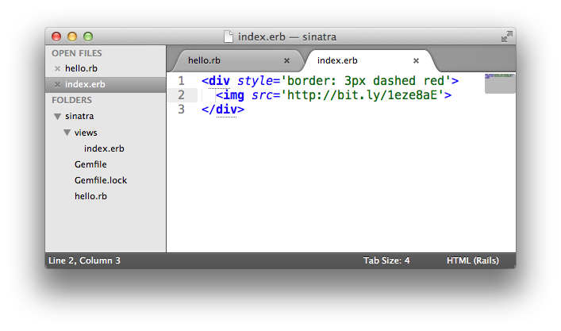
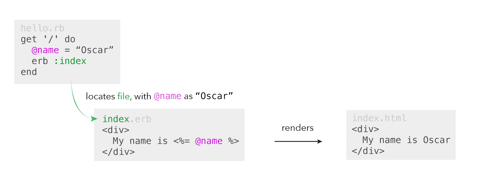
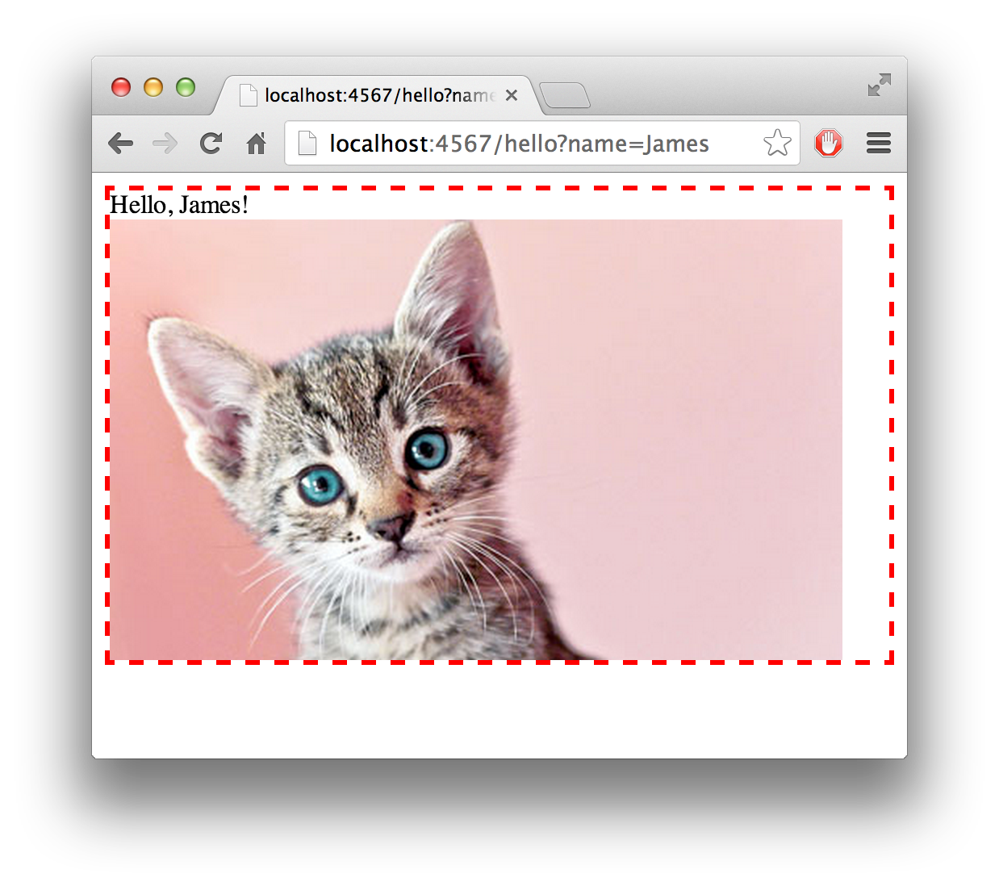
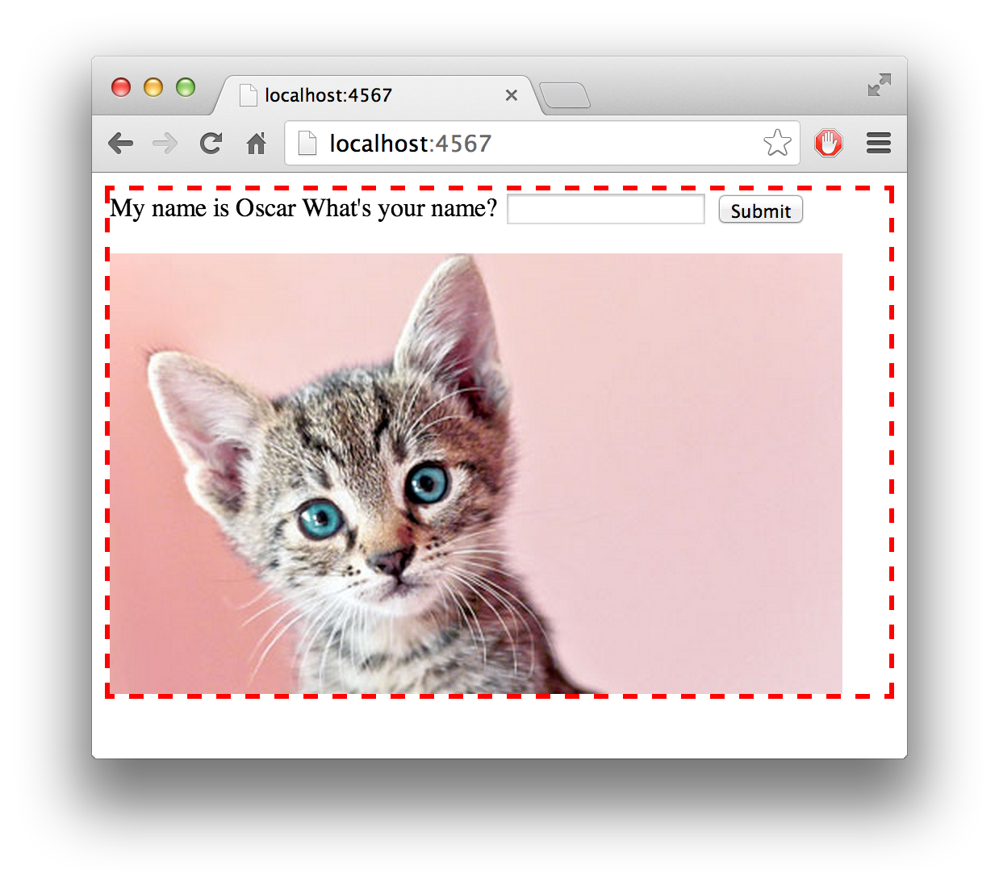
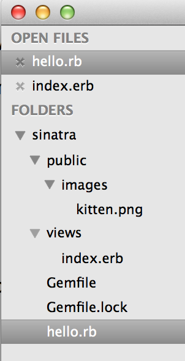

# Sinatra

[Sinatra](http://www.sinatrarb.com/) is a simple, no-frills web application framework for Ruby. It allows you to integrate applications written in Ruby with a web interface, so anyone with a browser can use them. In contrast to more complex web application frameworks such as [Ruby on Rails](http://rubyonrails.org), Sinatra provides very little beyond making your ruby code accessible to requests that come over the HTTP protocol.

<aside>
  Sinatra is one of many simple web application frameworks.  You can read about some of the alternatives in [this blog post](http://www.sitepoint.com/ruby-microframeworks-round/).
</aside>

As with every pill and project please do type in the code examples instead of copy-pasting them, it will help you to memorise and understand what you're doing.

***As always there may be subtle errors in the following materials.  Please try to approach any of these as challenges on which to polish your debugging skills - pull requests very welcome.***

## What you will learn

* How to set-up and use Sinatra
* Routes
* Templates
* Forms
* Parameters

## Prerequisites

You should be fully proficient in Ruby (post-precourse standard), including [blocks&nbsp;:pill:](pills/blocks.md). For later parts of this walkthrough, you will also need to be proficient with [HTML&nbsp;:pill:](pills/html.md) and [CSS&nbsp;:pill:](pills/css.md).

## Sinatra Installation

***Note, we recommend working through this pill with a pair partner. Please take turns on the keyboard as the driver as described in the [pairing pill&nbsp;:pill:](pills/pairing.md).***

As with every bit of non-trivial code you write it's a good idea to initialise a git repository and push your code to Github in order to back it up.  Put the following code in a Github repo called `sinatra-test`.

As mentioned above, Sinatra is just a Ruby [gem](pills/gems.md) :pill:, so you'll need to install it as usual:

`$ gem install sinatra`

<aside>
  Where does this install the Sinatra gem?
</aside>

However, a better way would be to put it in your Gemfile:

````ruby
# Gemfile
source 'https://rubygems.org'
gem 'sinatra'
````

and install using [bundler](pills/bundler.md) :pill::

`$ bundle install`

There are two advantages to this approach. Firstly, you'll be keeping a record of what gems are used in the project for other developers to see. Secondly, it will help Shotgun (we'll discuss it in a minute) to load Sinatra.

Once you have installed Sinatra, you are ready to create a web-accessible _Hello World_ application.

## _Hello World_ application

Let's create a basic web application using Sinatra. It will have only one page and on this page there will be "hello!" text. This is what it will look like:



Now, let's make it happen. Create a new file _hello.rb_ and type the following:

````ruby
require 'sinatra'

get '/' do
  'hello!'
end
````
<aside>Why are we requiring `sinatra.rb` in this file?</aside>

Now, run this file.

`$ ruby hello.rb`

You should see this:

```
== Sinatra/1.4.3 has taken the stage on 4567 for development with backup from Thin
>> Thin web server (v1.5.1 codename Straight Razor)
>> Maximum connections set to 1024
>> Listening on localhost:4567, CTRL+C to stop
```

Open [this address](http://localhost:4567) in the browser and you should see a white page with "hello!" in the upper left corner.

This would be a good time to commit your code, push it to Github (:pill: [Version Control with Git](https://github.com/makersacademy/course/blob/master/pills/git.md)), and switch Driver/Navigator Roles&nbsp;:twisted_rightwards_arrows:

<aside>:pill: [`localhost` and web host addresses](https://github.com/makersacademy/course/blob/master/pills/localhost_web_addresses.md)</aside>

## How does _Hello World_ work?

So, let's take a look at the source code again.

````ruby
require 'sinatra'

get '/' do
  'hello!'
end
````

- First, we require Sinatra, the gem, to be available in our application. 
- Then we call the `get()` method, provided by Sinatra, passing `'/'` as an argument (this could therefore be re-written `get('/')` but the convention is to ignore the brackets). 
- What you're telling the Sinatra to do is to _get_ whatever the block returns, in this case the string 'hello!' whenever someone requests it by calling the page at the address '/':

```
User requests page '/' ->
get() block activated ->
'hello' string returned to get() block ->
get() block returns 'hello' string to User
```

The '/' part of the address is the last slash in `http://localhost:4567/`. If we wanted to have another page at `http://localhost:4567/secret`, then we'd do the following:

````ruby
require 'sinatra'

get '/' do
  'hello!'
end

get '/secret' do
  'This is a secret page'
end
````
But wait! Having done this in your Sinatra application, visiting `http://localhost:4567/secret` in a browser gives you this page:


An error! Another good time to commit your code, push it to Github (:pill: [Version Control with Git](https://github.com/makersacademy/course/blob/master/pills/git.md)), and switch Driver/Navigator Roles&nbsp;:twisted_rightwards_arrows:

### Reload your code

What's happening here? Nothing bad: Sinatra is telling you that it doesn't know what '/secret' is all about, despite you having written this in your app.

The problem: we haven't rebooted the server after making our changes. The running server has a `/` route, but no `/secret` one.

To stop the server, head to the terminal tab in which the server is running and hit `Ctrl-C`. Then restart the server just like you started it in the first place:

`$ ruby hello.rb`

Head back to _http://localhost:4567/secret_: it now works! But restarting the server manually every time we change the code is going to get very painful.

## Automatic code reloading

What we've been doing is restarting our server every time we made a change to the files because Sinatra needed to reload them. There's a way to reload the files without restarting the entire process.

Firstly, install a gem called **Shotgun** within this project. You already know how to require and install gems.

Secondly, load your application like this:

`$ shotgun hello.rb -p 4567`

The `-p` switch tells shotgun what port to use. Use this switch to keep the port consistent with the default Sinatra port. By default shotgun will use port 9393.

If you see a "Boot Error" when you're starting the application using shotgun, double check that you have required the _sinatra_ gem in the `Gemfile`, and have run `bundle install` afterwards.

<aside>What does `bundle install` do? Are there any other uses for `bundle`?</aside>

Assuming that you get Shotgun working you can now make changes to your `hello.rb` file and see the changes with a simple browser refresh.  Try adjusting the strings in the `do ... end` blocks and reload the browser.

##From Strings to HTML

"hello" is a boring thing to send to our users. We can do better!

Behind the scenes, Sinatra was actually sending "hello" as an [HTML](pills/html.md) file. Now we know that, we can just substitute our "hello" string for some cool HTML:

````ruby
require 'sinatra'

get '/' do
  "<div>
    
   </div>"
end
````

Now go to the webpage at the `localhost` address and check out the fruits of your labour. If the page isn't showing as you expect - are you using Shotgun?



A good time to commit your code, push it to Github (:pill: [Version Control with Git](https://github.com/makersacademy/course/blob/master/pills/git.md)), and switch Driver/Navigator Roles&nbsp;:twisted_rightwards_arrows:

However, this image, as lovely as it is, is a bit dull. Real web pages have something else in them that makes them look good: CSS.

CSS stands for Cascading Style Sheets. It's a language that describes what HTML elements should look like when they are rendered by the browser. For example, let's add some CSS code to create a border around the **div** that contains our image.

````ruby
require 'sinatra'
get '/' do
  "<div style='border: 3px dashed red'>
     
   </div>"
end
````

Now our web page looks like this:



To achieve this effect we added an **attribute** called **style** to the **div** element. Its **value** is "border: 3px dashed red". It defines what style is applied to the element, in this case a border, 3 pixels wide, dashed (as opposed to solid, for example), and red in colour.

By combining HTML and CSS we can achieve sophisticated visual effects in our web applications. We'll explore the basics of how HTML and CSS work in more details later this week and we'll discuss advanced HTML and CSS features in weeks 7 and 8.

Before we move on let's commit our code, push it to Github and switch Driver/Navigator Roles again&nbsp;:twisted_rightwards_arrows:

## ERB: Separating your Ruby from your HTML and CSS

So, we've got a kitten inside a box with a red border. The code looks like this

````ruby
require 'sinatra'

get '/' do
  "<div style='border: 3px dashed red'>
     
   </div>"
end
````

It works but you can already guess a problem: it doesn't scale. Web pages usually have hundreds, if not thousands lines of HTML and CSS code. That's on top of thousands of lines of Ruby code. Putting it all together in a single file would lead to a mess: lots of unstructured code that is very hard to maintain.

A better solution is to separate our Ruby and HTML code. Let's create a folder called **views**, located in the same directory as our _hello.rb_ file. Then create **views/index.erb**. Let's move the HTML code into the file we just created, so your project structure and the new file look like this:



In our _hello.rb_ file we'll just put this instead:

````ruby
require 'sinatra'

get '/' do
  erb :index
end
````

Assuming this all works it's a good time to commit our code, push it to Github and switch Driver/Navigator Roles again&nbsp;:twisted_rightwards_arrows:, but the question that's likely on your mind is what's happening here? On line 4 in the do ... end block, we're calling **erb**, a templating system that ships with Ruby. We are asking it to render it a file called **index.erb** from the folder **views**. How does it know to look inside the folder **views**? The name of the folder is just a convention: if you don't specify any other name, erb will assume that you want to use the file in the **views** folder.

We just called **erb** a templating system. The reason is that it's actually much more powerful than it may seem on the surface. Erb stands for Embedded Ruby. This means that the templates can combine plain text, such as HTML code, with executable Ruby code.

Let's say we want to give our kitten a name. We aren't sure what the name actually is, so let's select it from an array of kitten names randomly.

````ruby
get '/' do
  @name = %w(Amigo Oscar Viking).sample
  erb :index
end
````

We've just selected a name for the kitten in the instance variable **@name**. Let's now display it on the web page. Update your HTML to look like this:

````html
<div style='border: 3px dashed red'>
  My name is <%= @name %>
  
</div>
````

The second line contains the text and an embedded ruby tag. The code that begins with <% and ends with %> is an _erb_ tag, it is not part of HTML. Everything inside this tag is executed as Ruby code. In this case, we're just getting the value of **@name** variable. Because there is an = sign after the opening tag, the value will be "printed" to the resulting HTML. After erb processes this template, the HTML code that your browser actually sees will look like this:

````html
<div style='border: 3px dashed red'>
  My name is Oscar
  
</div>
````

Technically, the **erb()** method reads the input file, processes Ruby that is inside and returns resulting HTML. This HTML is then returned by the block passed to the **get()** method:



So, we've just learned how to extract HTML into separate files and how to transfer data from Ruby code into templates. Naturally you'll want to commit the code, push it to Github and switch Driver/Navigator Roles &nbsp;:twisted_rightwards_arrows: but once we've done that let's add some more sophistication to our kitten website.

## Parameters (aka Params)

Our current web page is not interactive. It doesn't take any input from the user but that could be a very useful feature. Pretty much any website you see online is interactive and that's what makes the web such an exciting place.

Let's make our kitten say hello to the visitor of the website. Add this method to

````ruby
get '/hello' do
  @visitor = params[:name]
  erb :index
end
````

This method expects a parameter called name that can be provided like this:

`http://localhost:4567/hello?name=James`

This parameter can be accessed using the **params** hash. This is provided to you by Sinatra, you don't have to declare it anywhere. So, if we pass the parameter "name" as part of the URL, then "James" will be available in params[:name]. If necessary, you can specify multiple parameters separated by ampersands:

`http://localhost:4567/hello?name=James&last_name=Cameron`

The question mark in the url serves to separate the address from the list of parameters.

Now, if you modify your erb template to expect this value, you'll see a welcome message if a name is provided:

````html
<div style='border: 3px dashed red'>
  <% if @visitor %>
    Hello, <%= @visitor %>!
  <% end %>
  <% if @name %>
    My name is <%= @name %>
  <% end %>
  
</div>
````

Notice that we're not just printing the name of the visitor on the screen, we're putting a welcome message "Hello, #{@visitor}" only if the visitor is defined. This way it won't be printed when we open the root url ("/") that displays the same template. To achieve this we're using a usual if statement, embedding it inside <% %> tags. Because we don't want to output the results of the if statement, that is, line 2 into the HTML, we don't put = after the opening tag or the closing tag on line 4. We do the same for the @name variable.

Now, if we go to _http://localhost:4567/hello?name=James_, we'll get the welcome message.



Github and switch! :twisted_rightwards_arrows:

### Forms

It's inconvenient to enter the visitor's name directly in the URL. Let's create a form to ask for the visitor's name. Modify your erb template:

````html
<div style='border: 3px dashed red'>
  <% if @visitor %>  
    Hello, <%= @visitor %>!
  <% else %>
    <form action="/hello">
      My name is <%= @name %>.
      What's your name?
      <input type="text" name="name">
      <input type="submit">
    </form>
  <% end %>
  
</div>
````

This is what it's going to look like:



So, what is happening in this code? First, we check if we have a value in @visitor. If we do, we greet the user. If we don't we display a form, described by yet another HTML tag.

The form tag creates a form that sends the data back to the server when it's submitted. The URL that the form data is sent to is defined by the **action** attribute. The data that is sent is determined by the fields that are present inside the form (before the closing </form> tag).

In this case we have two "input" fields. The first one is the input field (because it has type "text") and the second one is the submit button (because it has type "submit"). Even though they look and act differently, they are both created by the **input** tag.

Since the second input tag doesn't have any data in it (it's a button, after all), it won't be sent back to the server. But the first input tag will be. The string that you input into it will be sent back to the server as the "name" parameter because that's what we specified in the "name" attribute:

````html
<input type="text" name="name">
````

So, when you click the submit button, your browser sends a request to the URL specified in the **action** attribute of the form tag and sends all input fields from the **form** as parameters. That's why when you enter your name a click the button, you get redirected to /hello?name=YourName.


Github and switch! :twisted_rightwards_arrows:

## Static files

Earlier we've linked to an external image in our HTML. This is fine but it would be so much nicer to have the image as a part of our project. This would be a **static asset**, let's see how Sinatra handles them.

Let's put our image into **public/images/kitten.png** file in our project. The **public** folder doesn't exist, so create it as well as the images folder inside it. Now our file structure looks like this.



Please note that the only file in the views folder so far is _index.erb. Gemfile, Gemfile.lock_ and _hello.rb_ are in the top-level project directory.

Now let's update our image tag to refer to the image:

````html

````

You'll still see the image of the kitten but now it's loaded from localhost and not a remote server.

You probably have noticed that the address includes **images** folder but not the **public** folder. This is by design: Sinatra treats everything that's located inside the **public** folder as available via URLs. That's why by just putting a file there we were able to access it from the browser. This only works for the folder called **public**. You can't get to the views folder in the same way. The name is customisable, though: you can choose a different name for the **public** folder if you wish.

Of course, you can put anything you want inside this folder: not only images but also text files, executable files, CSS files (we'll get to them in a second) and many more things.

Github and switch! :twisted_rightwards_arrows: Although we are pretty much done with coding in this Sinatra pill - there are a few more things to explain.  Once you've read to the end of the pill why not try restarting this as a pair and re-creating the kitten app from scratch referring to the pill as little as possible?  Ultimately you should be able to build the app from memory.  Note of course that we are just playing around here, spiking a little app without any tests.  Best practise would avoid putting these quick spikes into production where many users would access them.

## Absolute vs relative URLs

However, there's a big problem with this code:

```html

```

It refers to an absolute URL, that is, a URL that includes everything: the protocol (http), server address and port (localhost:4567) and the path to the file. As you remember, localhost refers to the computer you're on, so this image tag would work if and only if there is a web-server running locally on port 4567 serving this file.

In other words, if a friend of yours open the kitten website you just created from another computer, she will get the HTML code but she won't see the kitten because localhost will refer to her computer and not yours.

Even if you're planning to make this website available later on my-lovely-kitten.com, it's a bad idea to use an absolute url because then you will need this website to be up and running while you're developing it (and you haven't finished building it yet). Catch 22. Finally, your website may be available on several different domains, e.g. my-lovely-kitten.com and my-lovely-kitten.co.uk. Which address to use in this case? The correct answer is to not use absolute URLs unless you have a good reason to.

So, how do we link to the image without mentioning the server address? Use a relative URL, like this:

```html

```

This tells the browser to use the address of the current website to fetch the page. So, for example, if this HTML page is server on localhost:4567, your browser will request this image:

```
http://localhost:4567/images/kitten.png
```

But if you have deployed your site to production and it's now running on my-lovely-kitten.com, your browser will fetch the image from

```
http://my-lovely-kitten.com/images/kitten.png
```

This applies not only to files but to all URLs. Remember, when we created a form, we used a relative URL?

```
<form action="/hello">
```

We could have used an absolute URL but it would have worked only on the computer the website is being developed on.

##  Two kinds of relative urls

So far when we were discussing relative URLs we assumed they were relative to the domain. So, if a web page at http://locahost:4567/ has this HTML, the browser will interpret it as http://localhost:4567/images/kitten.png.

```html

```

However, it's not always convenient. Sometimes you want your URL to be relative to the current path. Let's say you have this URL in your application:

```html
http://www.example.com/users/12345/galleries/4/kittens/index.html
```

This URL would show all photos in the kittens folder in gallery number 4 for the user number 12345. How do you reference an image in the kittens folder? One way would be to do it like this:

```html

```

However, you're forced to specify the full path to the image. Another solution is

```html

```

Note the lack of a slash in the beginning of the URL. This means that the path is relative to the current URL path: ```http://www.example.com/users/12345/galleries/4/kittens/```. So, the browser interprets '' as

```
http://www.example.com/users/12345/galleries/4/kittens/1.png
```

but only if this HTML is served by the page at

```
http://www.example.com/users/12345/galleries/4/kittens/index.html
```

If the same HTML were served by

```
http://www.example.com/users/index.html
```

it would have been interpreted as

```
http://www.example.com/users/1.png
```

A common beginner mistake is to forget to put the slash at the beginning of the relative URL, watch out for it.

Having completed this pill you should have a reasonable understanding of a basic Sinatra app.

Exercises
--------

* :running_shirt_with_sash: Try recreating this app without referring to the pill
* Try recreating this app but with a different image and generating a different sort of text rather than a greeting, e.g. answering a simple question that ruby can answer, like is this string a number?

Resources
--------

* [Sinatra Main Site](http://www.sinatrarb.com/)
* [Sinatra Main Intro Documentation](http://www.sinatrarb.com/intro.html)
* [Talk Slides on Sinatra Chat Server](http://obfusk.org/achatwithsinatra/#1)
* [Detailed Talk Slides on Sinatra](http://www.slideshare.net/BobNadlerJr/sinatra-flatiron)
* [Sinatra Up and Running (Book)](http://shop.oreilly.com/product/0636920019664.do)
* [Jump Start Sinatra (Book)](http://www.sitepoint.com/store/jump-start-sinatra/)
