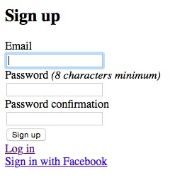

# Yelp

### V2 Walkthrough

@@TOC@@

In this version, we want to add user login. In Sinatra, this requires you to manually add a User model, and then create all the usual controller routes – for login, logout, signing up and so on. How tedious.

Rails has a gem that does all of that for you – [Devise](https://github.com/plataformatec/devise). It handles building a user model, routes for your users controller, and even fancy things like OAuth (which handles those 'Log in with Facebook'-type buttons).

Let's get started.

#### Installing Devise

Add Devise to your Gemfile –

```ruby
gem 'devise'
```

and install it with `bundle install`.

The run the Devise generator:

`$ rails g devise:install`

(Remember, the `g` is short for `generate`.) Now you're ready to tell Devise to make your User model:

`$ rails g devise User`

And run `$ rake db:migrate` to get that lovely users table added to your database.

This does the following:

* *creates a database migration to add a Users table*
* *adds a User model*, which tells Rails about the properties that our users should have
* *updates `config/routes.rb`* with the relevant user signin, signout and signup routes
* *adds a Users controller* (really the Devise controller) which gives Rails the commands to deal with users.

#### How do I log into this thing?

Have a look at `app/models/user.rb` to get the gist of your new User class.

That's Devise pretty well done. It's now given you all the necessary kit for creating and logging in users, and running `rake routes` will show you this:

```
                  Prefix Verb   URI Pattern                    Controller#Action
        new_user_session GET    /users/sign_in(.:format)       devise/sessions#new
            user_session POST   /users/sign_in(.:format)       devise/sessions#create
    destroy_user_session DELETE /users/sign_out(.:format)      devise/sessions#destroy
           user_password POST   /users/password(.:format)      devise/passwords#create
       new_user_password GET    /users/password/new(.:format)  devise/passwords#new
      edit_user_password GET    /users/password/edit(.:format) devise/passwords#edit
                         PATCH  /users/password(.:format)      devise/passwords#update
                         PUT    /users/password(.:format)      devise/passwords#update
cancel_user_registration GET    /users/cancel(.:format)        devise/registrations#cancel
       user_registration POST   /users(.:format)               devise/registrations#create
   new_user_registration GET    /users/sign_up(.:format)       devise/registrations#new
  edit_user_registration GET    /users/edit(.:format)          devise/registrations#edit
                         PATCH  /users(.:format)               devise/registrations#update
                         PUT    /users(.:format)               devise/registrations#update
                         DELETE /users(.:format)               devise/registrations#destroy
```

Boot up your server with `$ rails s` and try visiting `/users/sign_in`.

#### Adding links to log in and out

So we've got routes that let our users sign-in/-out/-up, but they have no way of getting to them. Time to update our view logic!

As always, let's test first. **There's no real need to test Devise's internals** – the user model and so on – because we can probably assume that they work pretty well. Instead, let's write a feature test.

`spec/features/users_feature_spec.rb`:

```ruby
require 'rails_helper'

context "user not signed in and on the homepage" do
  it "should see a 'sign in' link and a 'sign up' link" do
    visit('/')
    expect(page).to have_link('Sign in')
    expect(page).to have_link('Sign up')
  end

  it "should not see 'sign out' link" do
    visit('/')
    expect(page).not_to have_link('Sign out')
  end
end

context "user signed in on the homepage" do
  it "should see 'sign out' link" do
    visit('/')
    expect(page).to have_link('Sign out')
  end

  it "should not see a 'sign in' link and a 'sign up' link" do
    visit('/')
    expect(page).not_to have_link('Sign in')
    expect(page).not_to have_link('Sign up')
  end
end
```

Now we need to add these links to the view logic. Specifically, we need to tell the app to show certain links dependent on whether or not a user is logged in.

In `views/layout/application.rb`, add a sign out link:

```erb
<% if user_signed_in? %>
<%= link_to "Sign out", destroy_user_session_path, method: :delete %>
...
```

And now we need sign in and sign up links, so add this to the above:

```erb
...
<% else %>
<%= link_to "Sign in", new_user_session_path %>
<%= link_to "Sign up", new_user_registration_path %>
```

And now we should be green.

#### Adding OmniAuth login

For this example, we'll be adding a 'sign in with Facebook' link.

##### Register a Facebook Developer application

Create a [Facebook Developer application](http://developers.facebook.com), making note of the two keys you're given.

The first step then is to add an OmniAuth gem to your application. This can be done in our Gemfile:

```ruby
gem 'omniauth-facebook'
```

Here we'll use Facebook as an example, but you are free to use whatever and as many OmniAuth gems as you'd like. Generally, the gem name is "omniauth-provider" where provider can be "facebook" or "twitter", for example. For a full list of these providers, please check [OmniAuth's list of strategies](https://github.com/intridea/omniauth/wiki/List-of-Strategies). 

Next up, you should add the columns "provider" (string) and "uid" (string) to your User model. 

```shell
$ rails g migration AddColumnsToUsers provider uid
$ rake db:migrate
```

Next, you need to declare the provider in your `config/initializers/devise.rb`:

```ruby
config.omniauth :facebook, "APP_ID", "APP_SECRET"
```

and replace `APP_ID` and `APP_SECRET` with your app id and secret. **Bear in mind – committing secrets to public git repos is a super bad idea!** Let's go with it for now, but at the end we'll come back to this and look at a better way of doing it.

Now you need to make the User model that Devise created 'omniauthable',

`app/models/user.rb`:

```ruby
devise :omniauthable, :omniauth_providers => [:facebook]
```

Restart your server if it's running. Devise will now create the following routes:

* user_omniauth_authorize_path(provider)
* user_omniauth_callback_path(provider)

And now, as if by magic...



Devise is great!

##### Keeping secrets properly

The proper way of saving secrets is to abstract them out into a separate file.

Add your Facebook keys to the Rails `secrets.yml` file. They can then get called into the above code without needing to check them into version control. Call them using the following:

`Rails.application.secret.NAME_OF_SECRET`

Make sure that `secrets.yml` is in your `.gitignore` file to prevent it being picked up by version control. (Bear in mind that at this point it's already in your Git history, so it's not actually gone. To remove secrets from a repo's history, try following [this tutorial](https://help.github.com/articles/remove-sensitive-data/).)

**This becomes super, super important when using Amazon Web Services because *those secrets are linked to your credit card details*.** Be careful!

Anyway – all of the above is in [this tutorial](https://github.com/plataformatec/devise/wiki/OmniAuth:-Overview) if you want to read more on OmniAuth and Devise.


